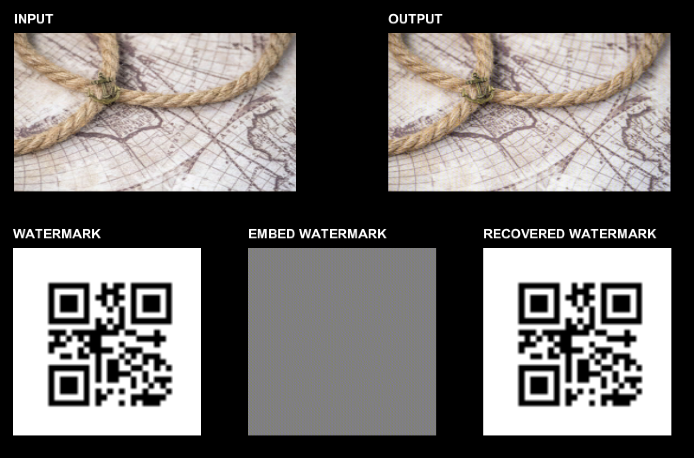
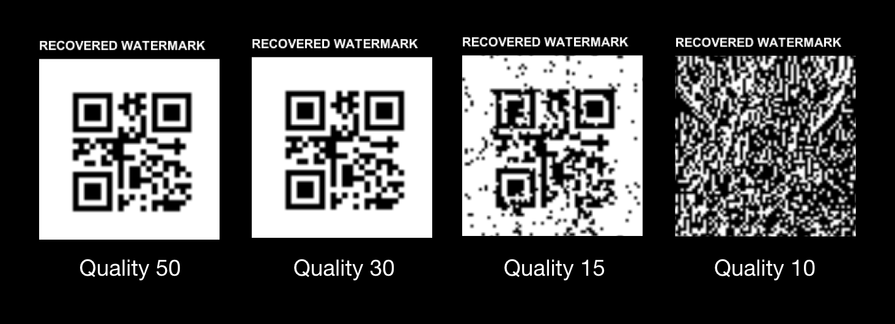

# Unity texture watermark with DWT & DCT

An experiment to embed watermark to texture with DWT (Discrete wavelet transform) and DCT (Discrete cosine transform).

Mainly based on the algorithmn from these repositories.

-   https://github.com/mchall/HiddenWatermark
-   https://github.com/ShieldMnt/invisible-watermark
-   https://github.com/accord-net/framework

# Jpeg Attack

# License

GNU
